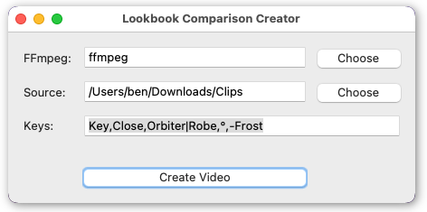

# LOOKBOOK COMPARISON CREATOR

Eine genauere Beschreibung / Download Link der Daten gibt es in dem [HdM DokuWiki](vfx-web.hdm-stuttgart.de/dokuwiki/) und eine aktuelle Version dieses Tools auf [Github](github.com/benjaminherb/lookbook-comparison-creator).

## StuPro Studiotechnik 2022

Das Python-Tool erstellt aus dem Lookbook mithilfe von FFmpeg Vergleichs-/Übersichtsvideos entsprechend vorher gegebener Eigenschaften. Dabei werden jeweils die passenden Einstellungen in 1080p und h264 ausgegeben.

## Voraussetzungen
Für das Tool wird [Python 3](https://www.python.org/downloads/) und [FFmpeg](https://ffmpeg.org/download.html) benötigt.

* Windows: Doppelklick / "Öffnen mit -> Python" oder im Terminal "python3.exe LookbookComparisonCreator.py"
* MacOS: "Öffnen mit -> Python Launcher" oder im Terminal "python3 LookbookComparisonCreator.py"
* Linux: "Als Program ausführen" oder im Terminal "python LookbookComparisonCreator.py"

## Nutzung
**FFmpeg:** Pfad zur FFmpeg binär Datei. Sofern es bereits im System installiert und zur 'PATH' Variablen hinzugefügt (also im Terminal über 'ffmpeg' oder 'ffmpeg.exe' aufrufbar) ist, kann auch das verwendet werden.

**Source:** Pfad zu dem Source Clips Ordner

**Keys:** Auswahl der gewünschten Clips mit durch Kommas separierten Eigenschaften (aus den Dateinamen der Source Clips). Entweder/oder Eigenschaften können durch ein '|' getrennt angegeben werden (zB. Orbiter|Robe) und auszuschließende Eigenschaften durch ein '-' (zB. -Frost)

### Beispiele:
* Key,Close,Orbiter (= alle Nahaufnahmen vom Orbiter)
* Key,Wide,Mini Mix|Maxi Mix,1D (= alle Totalen mit Mini Mix oder Maxi Mix mit Diffusion)
* Key,Wide,Robe|Orbiter,°,-Frost  (= alle harten (zB. 15°,30°) Aufsätze vom Orbiter/Robe ohne Frost)

